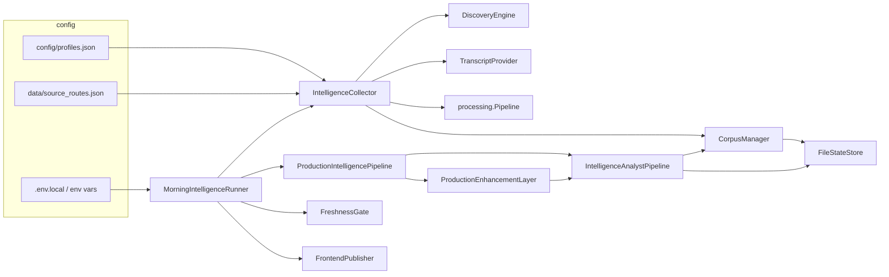
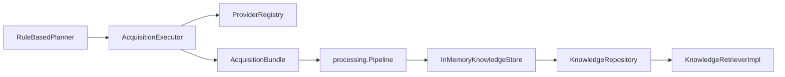

# Architecture Map — As Implemented (2026-07)

This document maps the **actual** `src/knowledge_service/` layout against the layered specification in `ARCHITECTURE.md`. It reflects code paths, not roadmap aspirations.

## Executive Summary

Knowledge_Service is a **layered monolith** that evolved through Phases 1–6. The Phase 0 six-layer model (API → Planning → Acquisition → Processing → Knowledge → Providers) is implemented for the **generic knowledge pipeline**, but the **production morning-intelligence path** bypasses several of those layers and uses a parallel **file-backed state tree** instead of PostgreSQL.

| Layer (spec) | Implemented? | Primary code |
|--------------|--------------|--------------|
| API Layer | **No** — `docs/API_SPEC.md` is specification only; no HTTP server in repo |
| Planning Layer | Yes | `planning/planner.py`, `planning/executor.py` |
| Acquisition Layer | Yes | `acquisition/acquisition_bundle.py`, `planning/executor.py` |
| Processing Layer | Yes | `processing/pipeline.py` (7 stages) |
| Knowledge Layer | Partial | `storage/`, `retrieval/` — used in tests/certification; production uses `intelligence/corpus.py` + `FileStateStore` |
| Provider Layer | Yes | `providers/`, `registry/provider_registry.py` |

Above the core pipeline sit three **operational subsystems** that drive the product today:

1. **Intelligence** (`intelligence/`) — profile-driven discovery, acquisition orchestration, corpus persistence, route certification
2. **Analyst** (`analyst/`) — claim extraction, scoring, synthesis (active production path)
3. **Production** (`production/`) — LLM enhancement, embeddings, personalization, morning brief v3, static publish

## Layered View (Actual)

```mermaid
flowchart TB
    subgraph entry [Entry Points — No HTTP API]
        CLI["python -m knowledge_service.production.morning"]
        CERT["examples/certify_*.py"]
        INSPECT["examples/runtime_inspector.py"]
    end

    subgraph morning [Phase 6 — Morning Intelligence]
        MR[production/morning/daily_runner.py]
        FG[production/morning/freshness_gate.py]
        PUB[production/morning/publisher.py]
    end

    subgraph prod [Phase 5 — Production]
        PP[production/pipeline.py]
        ENH[production/enhancement.py]
        LLM[production/llm/*]
        EMB[production/embeddings/*]
        PER[production/personalization/*]
    end

    subgraph analyst [Phase 4 — Analyst — Active]
        AP[analyst/pipeline.py]
        SYN[analyst/synthesis/pipeline.py]
        AST[analyst/store.py]
    end

    subgraph intel [Phase 3 — Intelligence Collection]
        COL[intelligence/collector.py]
        DIS[intelligence/discovery.py]
        CORP[intelligence/corpus.py]
        RR[intelligence/route_registry.py]
        SCH[intelligence/scheduler.py]
        FSS[intelligence/state.py FileStateStore]
    end

    subgraph core [Core Knowledge Pipeline]
        PLN[planning/planner.py + executor.py]
        PROC[processing/pipeline.py]
        ACQ[acquisition/acquisition_bundle.py]
        RET[retrieval/retriever.py]
        STO[storage/postgres/* + repositories]
    end

    subgraph providers [Provider Layer]
        TP[providers/transcript_provider.py]
        C4[providers/crawl4ai_provider.py]
        SX[providers/searxng_search_provider.py]
        PR[registry/provider_registry.py]
    end

    CLI --> MR
    MR --> COL
    MR --> PP
    PP --> AP
    PP --> ENH
    ENH --> LLM
    ENH --> EMB
    ENH --> PER
    AP --> SYN
    AP --> CORP
    COL --> DIS
    COL --> TP
    COL --> PROC
    COL --> CORP
    CORP --> FSS
    AST --> FSS
    PLN --> ACQ
    PLN --> PR
    CERT --> COL
    CERT --> AP
    INSPECT --> TP
    INSPECT --> PROC
    INSPECT --> RET
    INSPECT --> STO
    MR --> FG
    MR --> PUB
```

## Subsystem Map

### 1. Core Pipeline (Phases 0–2)

Generic query → plan → acquire → process → store → retrieve. Used by certification scripts and integration tests, **not** by the morning runner directly.

| Package | Responsibility | Key types |
|---------|----------------|-----------|
| `interfaces/` | Provider contract | `Provider`, `ProviderRequest`, `ProviderType` |
| `registry/` | Capability-based provider lookup | `ProviderRegistry` |
| `planning/` | Rule-based search-then-crawl plans | `RuleBasedPlanner`, `AcquisitionExecutor` |
| `acquisition/` | Raw content bundles | `AcquisitionBundle`, `DocumentRecord` |
| `processing/` | 7-stage normalization | `Pipeline` → `KnowledgeObject` list |
| `knowledge_object.py` | Canonical schema | `KnowledgeObject`, enums |
| `storage/` | `KnowledgeStore` interface + PG/in-memory | `PostgreSQLKnowledgeStore`, `InMemoryKnowledgeStore`, `KnowledgeRepository` |
| `retrieval/` | Deterministic queries | `KnowledgeRetrieverImpl`, `search_quotes` |

### 2. Intelligence Collection (Phase 3)

Profile-driven podcast/transcript ingestion with file-backed persistence.

| Package | Responsibility | State files (under `state/`) |
|---------|----------------|------------------------------|
| `intelligence/collector.py` | End-to-end collection job | `jobs.json` |
| `intelligence/discovery.py` | Discover episodes via discoverer registry | `discovery_runs.json` |
| `intelligence/discoverers/` | Pluggable source types (podcast, conference, stubs) | — |
| `intelligence/corpus.py` | Episode + KO persistence | `episodes.json`, `knowledge_objects.jsonl`, `profiles.json` |
| `intelligence/dedupe.py` | Transcript hash deduplication | dedupe state |
| `intelligence/route_registry.py` | Per-source acquisition route chains | `source_routes.json` (mirrors `data/source_routes.json`) |
| `intelligence/recertification.py` | Periodic route re-testing | `certification_history.json` |
| `intelligence/scheduler.py` | Daemon loop for scheduled collection | `scheduler.json` |
| `intelligence/inspector.py` | Engineering console | reads all above |
| `intelligence/config.py` | Profile load/save | `config/profiles.json` |

### 3. Analyst (Phase 4 — Active Path)

Runs on the corpus produced by Intelligence Collection. This is what `ProductionIntelligencePipeline` and `MorningIntelligenceRunner` invoke.

| Package | Responsibility | State files |
|---------|----------------|-------------|
| `analyst/pipeline.py` | Orchestrates full analyst run | `analyst/runs.json` |
| `analyst/claims/` | Claim extraction from KO corpus | `analyst/claims.jsonl` |
| `analyst/novelty/`, `relevance/`, `importance/`, `cross_source/`, `contradiction/` | Scoring engines | scored claim stores |
| `analyst/briefing/` | Phase 4 claim-level brief | `analyst/morning_brief.json` |
| `analyst/synthesis/` | Themes → items → intelligence brief v2 | `analyst/synthesis/*` |
| `analyst/store.py` | Analyst artifact persistence | under `state/analyst/` |

### 4. Legacy Intelligence Analyst (Phase 4 — Parallel)

`intelligence/analyst.py`, `intelligence/briefing.py`, `intelligence/claims.py`, etc. implement an **older Phase 4 pipeline** with separate artifact files (`phase4_runs.json`, `morning_briefs.jsonl`). Still referenced by:

- `intelligence/inspector.py` (Phase 4 summary section)
- `examples/certify_phase4_intelligence.py`

**Not** used by `production/morning/daily_runner.py` or `production/pipeline.py`.

### 5. Production (Phase 5–5.1.2)

Enhancement layer on top of analyst output.

| Package | Responsibility |
|---------|----------------|
| `production/pipeline.py` | `analyst.run()` → `enhancement.enhance()` |
| `production/enhancement.py` | Re-embedding, ranking, trends, brief v3, LLM polish |
| `production/llm/` | Provider registry (`analyst_heuristic`, `xai_responses`, `openai_compatible`), budget, cache |
| `production/embeddings/` | `local_neural` sentence-transformer embeddings |
| `production/personalization/` | Feedback, ranking adaptation |
| `production/briefing/morning_brief_v3.py` | Final brief structure |
| `production/conversation/deep_dive_v3.py` | Interactive sessions |
| `production/scheduler/brief_scheduler.py` | Brief run cadence tracking |
| `production/store.py` | Production artifacts under `state/production/` |

### 6. Morning Intelligence (Phase 6)

Daily operator entry point integrated with PCC preflight.

| Package | Responsibility |
|---------|----------------|
| `production/morning/daily_runner.py` | Full daily workflow |
| `production/morning/freshness_gate.py` | Filters stale items before brief |
| `production/morning/publisher.py` | Writes `frontend/latest.{html,md,json}` |
| `production/morning/env.py` | Loads `.env.local` for launchd |
| `production/morning/logger.py` | Structured logs to `~/Library/Logs/pcc/` |

## Dependency Graph

### Production morning path (dominant runtime)

### Generic certification path (tests / examples)

## Storage Topology (Two Parallel Models)

| Model | Backend | Used by | Persistence |
|-------|---------|---------|-------------|
| **File state** | `FileStateStore` — JSON/JSONL under `state/` | Intelligence, Analyst, Production, Morning | Survives restart; corpus in `knowledge_objects.jsonl` |
| **Repository store** | `InMemoryKnowledgeStore` or `PostgreSQLKnowledgeStore` | Tests, `examples/certify_acquisition_ladder.py`, `runtime_inspector.py` | In-memory is ephemeral; PostgreSQL requires connection string (not wired to morning path) |

Knowledge objects in the production path are stored as **JSONL dicts** in `state/knowledge_objects.jsonl` via `CorpusManager._store_knowledge_objects()`, not through `KnowledgeRepository`.

## Provider Inventory

| Provider | File | Used in production collection? | Used in generic planner path? |
|----------|------|-------------------------------|------------------------------|
| `TranscriptProvider` | `providers/transcript_provider.py` | **Yes** — primary acquisition | Yes (inspector, certification) |
| `Crawl4AIProvider` | `providers/crawl4ai_provider.py` | No | Yes (certification ladder) |
| `SearXNGSearchProvider` | `providers/searxng_search_provider.py` | No | Yes (certification ladder) |

Intelligence collection acquires via `TranscriptProvider` + `AcquisitionRouteRegistry` route chains, **not** via `RuleBasedPlanner`.

## Configuration Sources

| Config | Loader | Format |
|--------|--------|--------|
| Intelligence profiles | `intelligence/config.load_profiles()` | `config/profiles.json` |
| Source routes | `AcquisitionRouteRegistry` | `data/source_routes.json` or YAML |
| LLM provider | `production/llm/config.load_llm_config()` | Environment variables |
| Morning env secrets | `production/morning/env.load_env_local()` | `.env.local`, `.env`, `~/.config/knowledge_service/.env.local` |
| Collector tuning | `FileStateStore.read_json("collector_config.json")` | Optional state file |

The YAML structure described in `docs/CONFIGURATION.md` is **not** centrally loaded by a config service; each subsystem reads its own files/env.

## Identified Coupling Issues

### 1. Duplicate Phase 4 implementations (`intelligence/` vs `analyst/`)

Two parallel analyst stacks exist:

- **Active:** `analyst/pipeline.py` → used by production
- **Legacy:** `intelligence/analyst.py` → used by Phase 4 certification and inspector summaries

Both implement claim extraction, novelty, relevance, importance, briefing. Divergence risk is high; inspector merges both views.

### 2. Production tightly coupled to Analyst internals

`production/enhancement.py` imports `AnalystStore`, `SynthesisStore`, and reaches into `pipeline_result.synthesis`. `production/pipeline.py` constructs `IntelligenceAnalystPipeline` directly and exposes `pipeline.analyst.store` to `daily_runner.py` for claim-diff logic.

There is no interface boundary between Production and Analyst; they share `FileStateStore` paths by convention.

### 3. Shared `FileStateStore` as universal dependency

`intelligence.state.FileStateStore` is imported by:

- `analyst/store.py`
- `production/store.py`
- `production/llm/registry.py`
- `production/enhancement.py`
- `production/inspector.py`

All subsystems assume a single `state_dir` tree. This works but prevents independent deployment or schema versioning per subsystem.

### 4. Knowledge Layer bypass in production path

The spec says Processing → Knowledge Layer → Retrieval. In production:

`Processing.Pipeline` → `CorpusManager` → `knowledge_objects.jsonl`

Retrieval (`KnowledgeRetrieverImpl`) is never called in the morning workflow. Analyst reads KO dicts directly from corpus.

### 5. Global LLM singleton

`production/llm/registry.py` holds module-level `_active_llm` and `_persistence_bound`. Concurrent runs or tests can interfere unless `configure_llm()` resets state.

### 6. Inspector cross-subsystem imports

`intelligence/inspector.py` imports `analyst.inspector.inspect_analyst_runtime`. `production/inspector.py` re-exports analyst inspection. Circular knowledge of all artifact filenames across phases.

### 7. Planning layer unused in intelligence collection

`IntelligenceCollector` builds `AcquisitionBundle` manually and calls `TranscriptProvider` through route chains. `RuleBasedPlanner` / `AcquisitionExecutor` are dead code on the production path (still used in certification).

## Extension Points (Actual)

| To add… | Touch… |
|---------|--------|
| New podcast source type | `intelligence/discoverers/` + register in `DiscovererRegistry` |
| New transcript route | `data/source_routes.json` + `AcquisitionRoute` enum if new strategy |
| New LLM backend | `production/llm/registry._build_provider()` |
| New embedding backend | `production/embeddings/registry.configure_embeddings()` |
| New HTTP API | **Greenfield** — no `api/` package exists; would sit above Planning or Morning runner |
| New storage backend for production | Replace or bridge `CorpusManager._store_knowledge_objects()` |

## Related Documents

| Document | Relationship |
|----------|--------------|
| `ARCHITECTURE.md` | Original layered specification (Phase 0) |
| `API_SPEC.md` | **Not implemented** — target contract only |
| `RUNTIME_TRACE.md` | Step-by-step execution trace |
| `DATAFLOW.md` | Acquisition → publish data flow |
| `CONFIGURATION.md` | Aspirational config schema; partial overlap with env-based loading |