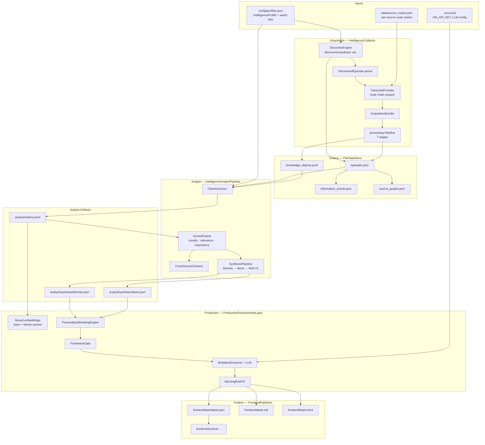
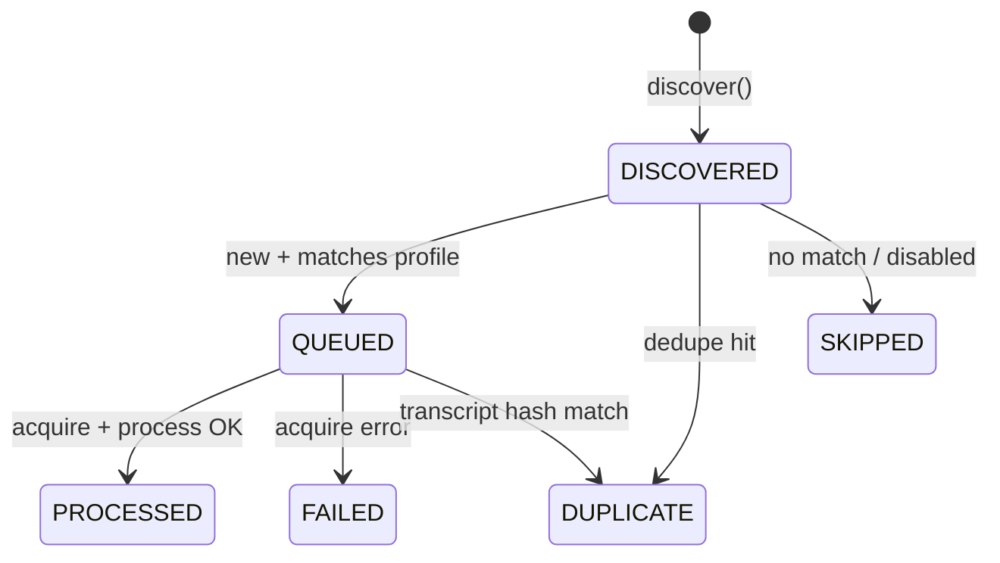
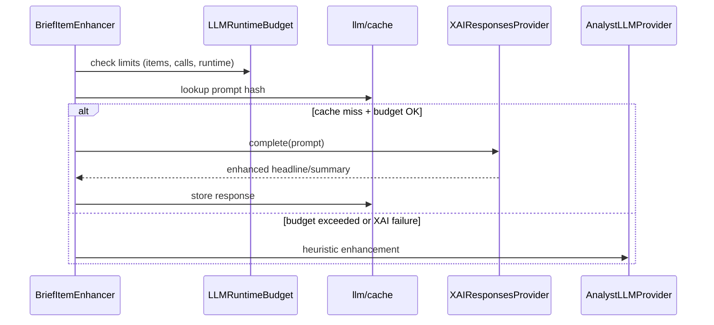
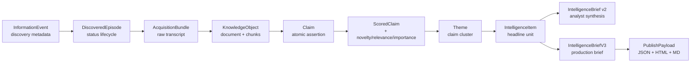
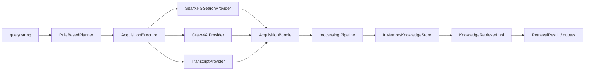

# Data Flow — Acquisition to Morning Brief Publish (2026-07)

End-to-end data flow for the **production morning intelligence path**, grounded in `production/morning/daily_runner.py` and its dependencies.

> Generic query→plan→crawl flows (SearXNG/Crawl4AI) are documented separately under [Certification Path](#alternate-path-certification--tests) below. They are **not** on the morning publish path.

## Overview



## Stage 1 — Profile & Route Configuration

### Data in

| Source | Schema | Consumed by |
|--------|--------|-------------|
| `config/profiles.json` | `{ profiles: [ IntelligenceProfile ] }` | `load_profiles()` → collector, corpus, analyst relevance |
| `data/source_routes.json` | Per-`source_id` route chains, certification | `AcquisitionRouteRegistry` |

### Transform

`IntelligenceProfile` contains:

- `profile_id`, `name`, `enabled`
- `watch_list[]` — people, podcasts, interests to monitor
- `podcast_sources[]` — feed URLs, list kinds

`AcquisitionRouteRegistry` maps `source_id` → ordered `AcquisitionRoute` values (e.g. `official_transcript` → `youtube_transcript_api` → `yt_dlp_whisper`).

### Data out

- `state/profiles.json` — working copy
- `state/source_routes.json` — runtime registry mirror

---

## Stage 2 — Discovery

### Trigger

`IntelligenceCollector.run_once()` → `DiscoveryEngine.discover(profiles)`.

### Data in

- Enabled profiles
- `DeduplicationStore` (known episode keys)
- `DiscovererRegistry` (default: podcast discoverer)

### Transform

For each profile watch entry / podcast source:

1. Discoverer fetches listing pages (HTTP via `httpx`)
2. Parses episode metadata (title, URL, date, show name)
3. Matches against watch-list interests
4. Assigns `DiscoveredEpisode` status: `QUEUED`, `DUPLICATE`, `SKIPPED`

### Data out

| Artifact | Content |
|----------|---------|
| `episodes.json` | All episodes with status lifecycle |
| `information_events.json` | Episode projection as information events |
| `source_graphs.json` | Person ↔ appearance graph edges |
| `discovery_runs.json` | Run metadata, discoverer list |



---

## Stage 3 — Acquisition & Processing

### Per queued episode

```
episode.url + source_id
    → route_registry.select_route()
    → TranscriptProvider.acquire() [try route chain]
    → transcript text + provenance metadata
```

### AcquisitionBundle assembly

`IntelligenceCollector` builds a minimal bundle:

```python
AcquisitionBundle(
    request_id=f"intelligence-{episode_id}",
    plan_id=f"profile-{profile_id}",
)
# + ExecutionRecord + DocumentRecord(raw_content=transcript)
```

### Processing pipeline

`processing.Pipeline.process(bundle)` transforms each `DocumentRecord`:

| Stage | Input | Output added to context |
|-------|-------|-------------------------|
| clean | raw HTML/text | normalized text |
| normalize | text | unicode, whitespace |
| extract | text | metadata, transcript structure, citations |
| markdown | content | canonical markdown |
| chunk | markdown | chunk boundaries |
| enrich | chunks | embeddings placeholder, semantic tags |
| validate | all | confidence score, warnings |

### KnowledgeObject emission

Per document → 1 `DOCUMENT` KO + N `CHUNK` KOs with:

- `source_type: video_transcript`
- `structured_data.metadata` — profile_id, episode_id, participants, route provenance
- `citations[]` — speaker/timestamp quote anchors
- `content_hash` — deduplication key

### Data out

| Artifact | Content |
|----------|---------|
| `knowledge_objects.jsonl` | Append-only KO dicts (document + chunks) |
| `episodes.json` | Status → `PROCESSED`, `knowledge_object_ids[]` |
| `corpus_growth.jsonl` | Per-episode growth metrics |
| `jobs.json` | `processed_count`, `duplicate_count`, timing |

---

## Stage 4 — Analyst (Claims → Synthesis)

### Trigger

`IntelligenceAnalystPipeline.run()` — reads **entire** processed corpus (not delta-only, though claims are deduped by ID).

### 4.1 Claim extraction

**In:** `corpus.knowledge_objects()` + processed `episodes` + `profiles`

**Transform:** `ClaimExtractor.extract_from_corpus()` — pulls declarative claims from chunk text with episode attribution.

**Out:** New claims appended to `analyst/claims.jsonl` (deduped by `claim_id`).

### 4.2 Scoring

For each new claim:

```
Claim
  → NoveltyEngine.score()      → novelty label + score
  → RelevanceEngine.score()    → profile relevance (uses watch lists)
  → ContradictionDetector      → conflicting prior claims
  → ImportanceEngine.score()   → composite importance
  → ScoredClaim
```

**Out:** `analyst/scored_claims.json`

### 4.3 Cross-source clustering

`CrossSourceEngine.build_clusters()` groups claims by semantic/topic overlap → corroboration counts feed back into importance.

**Out:** `analyst/clusters.json`

### 4.4 Synthesis (Phase 4.1)

```
ScoredClaims + Clusters
  → ThemeDiscoveryEngine        → Theme[]
  → ThemeEvolutionEngine        → ThemeEvolution[] (vs history)
  → IntelligenceItemEngine      → IntelligenceItem[] (headline + summary + evidence links)
  → IntelligenceBriefGenerator  → IntelligenceBrief v2
```

**Out:**

| File | Content |
|------|---------|
| `analyst/synthesis/themes.json` | Active themes + claim_ids |
| `analyst/synthesis/theme_history.jsonl` | Evolution events |
| `analyst/synthesis/items.json` | Rankable intelligence items |
| `analyst/synthesis/brief.json` | Intelligence brief v2 |

### 4.5 Legacy parallel (not on morning path)

`intelligence/analyst.py` writes separate `phase4_runs.json`, `morning_briefs.jsonl` — used only by legacy certification.

---

## Stage 5 — Production Enhancement

### Trigger

`ProductionEnhancementLayer.enhance(pipeline_result, ranked_items=...)`.

Morning runner may pass **freshness-filtered** `ranked_items`; default path ranks inside `enhance()`.

### 5.1 Neural re-embedding

```
analyst/claims.jsonl
  → configure_embeddings("local_neural")
  → sentence-transformer vectors on claims, scored claims, theme centroids
  → write back to analyst + synthesis stores
```

### 5.2 Personalized ranking

```
analyst/synthesis/items.json
  + personalization/feedback history
  → PersonalizedRankingEngine.rank()
  → reordered IntelligenceItem[]
```

### 5.3 Trend acceleration

```
themes + synthesis theme_evolutions + production trend history
  → TrendAccelerationEngine.analyze()
  → trend snapshots → state/production/trends.jsonl
```

### 5.4 Brief v3 + LLM enhancement

```
ranked IntelligenceItem[]
  → MorningBriefV3Generator.select_items()
  → BriefItemEnhancer.enhance_selected() [budget-limited LLM calls]
  → MorningBriefV3 (headlines, sections, quality_score)
```

**LLM data flow:**



**Out:**

| File | Content |
|------|---------|
| `state/production/brief_v3.json` | Latest morning brief v3 |
| `state/production/llm_budget.json` | Call counts, cache hits, estimated cost |
| `state/production/runs.json` | Enhancement run records |

---

## Stage 6 — Freshness Gate (Morning Only)

### Position in pipeline

Uniquely inserted by `MorningIntelligenceRunner` **after** analyst ranking, **before** `enhance()`:

```python
ranked_items = pipeline.enhancement.ranking.rank(items)
fresh_items, freshness_report = freshness_gate.filter_items(
    ranked_items,
    new_episode_ids=new_episode_ids,
    new_claim_ids=new_claim_ids,
    claims_by_id=claims_by_id,
)
```

### Decision inputs per item

| Signal | Source |
|--------|--------|
| New episode | `new_episode_ids` from acquisition diff |
| New claim | `new_claim_ids` from analyst claim diff |
| Theme state | `IntelligenceItem.theme_evolution_state` |
| Claim novelty | `Claim.novelty_class` |
| Claim age | `Claim.extracted_at` vs freshness window |

### Outcomes

| `no_fresh_signal` | Next step |
|-------------------|-----------|
| `false` | `enhance(analyst_result, ranked_items=fresh_items)` |
| `true` | `enhance(..., brief_override=build_empty_brief())` — no LLM calls |

---

## Stage 7 — Publish

### Trigger

`FrontendPublisher.publish()` in `daily_runner.py`.

### Payload structure

```json
{
  "generated_at": "ISO-8601",
  "empty_signal": false,
  "markdown": "# Morning Brief …",
  "brief": { "brief_id", "items", "total_items", "quality_score", … },
  "items": [ "IntelligenceItem dicts linked to brief" ],
  "documents": [
    { "label": "Today", "brief", "markdown", "items" },
    { "label": "Yesterday", … }
  ],
  "run_summary": { "acquisition", "analyst_run_id", "freshness_gate", "production", … }
}
```

### File outputs

| Path | Format | Consumer |
|------|--------|----------|
| `frontend/data/latest.json` | JSON | `frontend/app.js` static reader |
| `frontend/latest.md` | Markdown | Human reading, syndication |
| `frontend/latest.html` | HTML | Browser — embeds CSS/JS from `frontend/` |
| `frontend/archive/{YYYY-MM-DD}/` | Copy of above | Historical editions |

### Prior document rollover

`publisher.load_prior_documents()` reads existing `latest.json` documents; prior "Today" is shifted into archive/history list (max ~7 editions in HTML).

---

## Stage 8 — Observability & Run Record

### Logs

`MorningIntelligenceLogger` sections:

1. `network` — connectivity probe result
2. `acquisition` — job summary counts
3. `freshness_gate` — per-item decisions
4. `publish` — file paths written
5. `summary` — full redacted run dict

Written to `~/Library/Logs/pcc/morning-intelligence.log`.

### State record

`state/production/morning_runs.json` — append-only array of run summaries including:

- `watched_sources_checked`, `new_transcripts`, `claims_generated`
- `grok_calls`, `cache_hits`, `estimated_cost_usd`
- `degraded`, `empty_signal`, `errors[]`

---

## Data Types Through the Pipeline



---

## Alternate Path — Certification & Tests

Used by `examples/certify_acquisition_ladder.py`, `runtime_inspector.py`, and `tests/`.



**Key difference:** Knowledge objects land in `InMemoryKnowledgeStore` (ephemeral) and are queried via `KnowledgeRetrieverImpl` — not written to `state/knowledge_objects.jsonl`.

---

## What Does NOT Flow (Explicit Gaps)

| Spec / doc expectation | Actual behavior |
|------------------------|-----------------|
| HTTP API requests (`API_SPEC.md`) | No API server; CLI + static files only |
| Planning layer on every acquisition | Intelligence collector bypasses planner; direct provider calls |
| PostgreSQL knowledge store | Implemented but unused in morning path |
| Retrieval layer in production | Analyst reads KO dicts from corpus JSONL directly |
| Delta-only analyst runs | Full corpus scan; incrementalism only at claim-ID dedupe |
| CONFIGURATION.md central YAML loader | Per-subsystem env + JSON file loading |

---

## Related Documents

- `ARCHITECTURE_MAP.md` — subsystem boundaries and coupling
- `RUNTIME_TRACE.md` — function-level execution order
- `DAILY_MORNING_INTELLIGENCE.md` — operator runbook
- `API_SPEC.md` — **target** HTTP contract (not implemented)