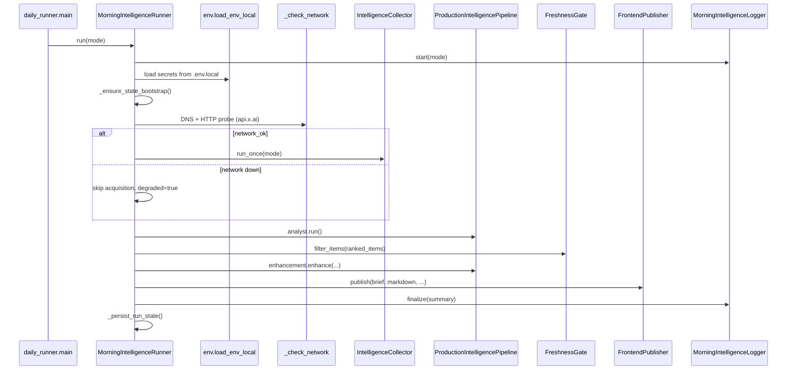
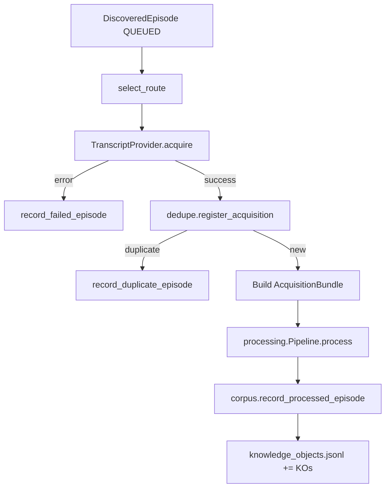

# Runtime Trace — As Implemented (2026-07)

Step-by-step trace of how Knowledge_Service starts, loads configuration, and executes its major workflows. All paths refer to actual code under `src/knowledge_service/`.

> **Note:** The HTTP API described in `docs/API_SPEC.md` is **not implemented**. There is no FastAPI, Flask, or uvicorn entry point in this repository. External access is via CLI, certification scripts, and static frontend artifacts.

## Entry Points

| Entry | Command / script | Primary module |
|-------|------------------|----------------|
| **Morning intelligence (production)** | `python -m knowledge_service.production.morning [run\|status]` | `production/morning/__main__.py` → `daily_runner.py` |
| Phase 3 certification | `python examples/certify_phase3_intelligence_collection.py` | `intelligence/collector.py` |
| Phase 4/4.1 certification | `python examples/certify_phase4_runtime.py` | `analyst/pipeline.py` |
| Phase 5 certification | `python examples/certify_phase5_runtime.py` | `production/pipeline.py` |
| Acquisition ladder | `python examples/certify_acquisition_ladder.py` | `planning/` + `retrieval/` |
| Runtime inspector | `python examples/runtime_inspector.py` | live transcript → processing → retrieval |
| Scheduled collection daemon | `RuntimeScheduler.run_daemon()` (via certification or custom script) | `intelligence/scheduler.py` |

---

## 1. Startup — Morning Intelligence (`python -m knowledge_service.production.morning`)

### 1.1 Module load

```
production/morning/__main__.py
  └─ daily_runner.main()
```

### 1.2 Argument parsing

`daily_runner.main()` accepts:

- `command`: `run` (default) or `status`
- `--mode`: `scheduled` (default) or `manual`

### 1.3 Runner construction

`MorningIntelligenceRunner.__init__()` resolves paths relative to service root (`parents[4]` from `daily_runner.py`):

| Path | Default |
|------|---------|
| `service_root` | Repository root |
| `state_dir` | `{service_root}/state` |
| `profiles_path` | `{service_root}/config/profiles.json` |
| `routes_path` | `{service_root}/data/source_routes.json` |
| `frontend_dir` | `{service_root}/frontend` |

### 1.4 `run()` sequence



### 1.5 State bootstrap

If `state/profiles.json` is missing:

1. Copy from `runtime_evidence/phase512_optimization_20260701T074324Z/state/` if present, else
2. Seed from `config/profiles.json` via `load_profiles()` + `save_profiles()`

### 1.6 Network preflight

`_check_network()`:

1. `socket.getaddrinfo("api.x.ai", 443)`
2. `urllib.request.urlopen("https://api.x.ai/v1", timeout=8)`
3. Fallback: `podscripts.co` reachability

Failure sets `degraded=true` and skips acquisition; analyst/production still run on existing corpus.

### 1.7 Status command

`runner.status()`:

- Loads env
- Reads `FileStateStore(state_dir)`
- Checks `frontend/latest.{html,md,json}`
- Returns last run summary from logger + public LLM config

---

## 2. Configuration Loading

### 2.1 Environment (morning + LLM)

`production/morning/env.load_env_local()` parses `KEY=VALUE` from (first existing):

1. `{repo}/.env.local`
2. `{repo}/.env`
3. `~/.config/knowledge_service/.env.local`

Only sets keys **not already** in `os.environ`. Secrets redacted in logs.

### 2.2 LLM configuration

`production/llm/config.load_llm_config()` reads environment:

| Variable | Default |
|----------|---------|
| `KNOWLEDGE_LLM_PROVIDER` | `analyst_heuristic` |
| `KNOWLEDGE_LLM_FALLBACK_PROVIDER` | `analyst_heuristic` |
| `KNOWLEDGE_LLM_MODEL` | `grok-4.3` |
| `XAI_BASE_URL` | `https://api.x.ai/v1` |
| `KNOWLEDGE_LLM_MAX_ITEMS` | `5` |
| `KNOWLEDGE_LLM_MAX_CALLS` | `20` |
| `KNOWLEDGE_LLM_MAX_RUNTIME_SECONDS` | `300` |

Provider selection in `production/llm/registry.get_llm_provider()`:

- `xai_responses` → `XAIResponsesProvider` (requires `XAI_API_KEY`)
- `openai_compatible` → `OpenAICompatibleProvider` (requires `OPENAI_API_KEY`)
- default → `AnalystLLMProvider` (heuristic, no network)

### 2.3 Intelligence profiles

`intelligence/config.load_profiles(path)`:

- Reads JSON (or YAML with PyYAML) from `config/profiles.json`
- Returns `List[IntelligenceProfile]`
- Copied into `state/profiles.json` by collector on init

### 2.4 Source route registry

`intelligence/route_registry.AcquisitionRouteRegistry`:

- Loads `data/source_routes.json` (or `.yaml`)
- Mirrors into `state/source_routes.json`
- Provides per-`source_id` route chains and confidence scores

### 2.5 Collector runtime config

Optional `state/collector_config.json`:

- `acquisition_delay_seconds` — throttle between episode acquisitions

### 2.6 Freshness gate config

`production/morning/freshness_gate.py` reads optional env:

- `KNOWLEDGE_FRESHNESS_HOURS` — claim age window
- `KNOWLEDGE_FRESHNESS_REQUIRE_NEW_EPISODE` — boolean gate

---

## 3. Providers

### 3.1 TranscriptProvider (production acquisition)

**Init:** `IntelligenceCollector.__init__()` creates `TranscriptProvider("intelligence-transcript-provider")` and calls `initialize({"timeout_ms": timeout_ms})`.

**Acquisition per episode** (`collector._process_episode()`):

1. `route_registry.select_route(source_id, url)` → route chain
2. `_acquire_with_route_chain()` tries routes in order
3. Each route maps to `ProviderRequest` options via `ROUTE_PROVIDER_OPTIONS`
4. `TranscriptProvider.acquire()` priority:
   - Published transcript page
   - YouTube captions (`youtube_transcript_api`)
   - Whisper fallback (`whisper` + `yt_dlp`)

**Output:** `ProviderResponse` with transcript text + provenance metadata.

### 3.2 Crawl4AI + SearXNG (certification only)

Used when `examples/certify_acquisition_ladder.py` or similar registers providers in `ProviderRegistry` and runs `RuleBasedPlanner` → `AcquisitionExecutor`.

Not invoked by `IntelligenceCollector` or morning runner.

### 3.3 Provider registry (generic path)

`registry/provider_registry.ProviderRegistry`:

- `register(provider)` indexes by `ProviderType` capability flags
- `get_first_healthy(type)` picks first provider passing `health()`

---

## 4. Intelligence Collection

### 4.1 Collector init

`IntelligenceCollector(state_dir, ...)`:

1. `FileStateStore(state_dir)`
2. `CorpusManager(state)`
3. Load/save profiles to state
4. `DeduplicationStore`, `AcquisitionRouteRegistry`, `DiscoveryEngine`
5. `TranscriptProvider` init
6. `migrate_corpus_state()` — schema migrations
7. `_bootstrap_registry_metrics()` — refresh route confidence, run recertification if due

### 4.2 `run_once(mode)` steps

| Step | `job.current_step` | Action |
|------|-------------------|--------|
| Discovery | `discovery` | `DiscoveryEngine.discover(profiles)` via `DiscovererRegistry` |
| Corpus update | — | `corpus.record_discovered_episodes()` |
| Acquisition | `acquisition` | For each `QUEUED` episode: `_process_episode()` |
| Complete | `complete` | Finalize `CollectionJob` → `jobs.json` |

### 4.3 Per-episode processing



### 4.4 Scheduler daemon

`RuntimeScheduler.run_daemon()`:

1. Install SIGINT/SIGTERM → `request_stop()`
2. Loop: `collector.run_once(mode="scheduled")`
3. Sleep `interval_seconds` (default 3600)
4. Write `scheduler.json` after each iteration

---

## 5. Processing

### 5.1 Pipeline stages

`processing/pipeline.py` — `Pipeline.process(AcquisitionBundle)`:

| Order | Stage | Module |
|-------|-------|--------|
| 1 | clean | `processing/clean.py` |
| 2 | normalize | `processing/normalize.py` |
| 3 | extract | `processing/extract.py` |
| 4 | markdown | `processing/markdown.py` |
| 5 | chunk | `processing/chunk.py` |
| 6 | enrich | `processing/enrich.py` |
| 7 | validate | `processing/validate.py` |

Each document in `bundle.acquired_documents` becomes one or more `KnowledgeObject` instances (document + chunks).

### 5.2 Transcript-specific handling

`processing/transcript.py` — invoked from extract stage for `video_transcript` source types; parses speaker labels, timestamps, builds citation structures.

### 5.3 Failure behavior

Stage exceptions append to `ctx.errors`, apply confidence penalty, continue pipeline (partial results).

---

## 6. Storage

### 6.1 Production path — FileStateStore

`intelligence/state.FileStateStore`:

- Atomic writes via `.tmp` + `os.replace`
- `read_json` / `write_json` / `read_jsonl` / `append_jsonl`

**Corpus persistence** (`corpus.py`):

- Episodes → `episodes.json`, `information_events.json`
- Knowledge objects → `knowledge_objects.jsonl` (serialized KO dicts)
- Source graphs → `source_graphs.json`
- Growth metrics → `corpus_growth.jsonl`

### 6.2 Repository path — tests/certification

`storage/postgres/in_memory_store.InMemoryKnowledgeStore`:

- In-process dict storage
- Used by `KnowledgeRepository` → `KnowledgeRetrieverImpl`
- **Ephemeral** unless explicitly populated in same process

`storage/postgres/store.PostgreSQLKnowledgeStore`:

- Full `KnowledgeStore` implementation with psycopg2
- **Not wired** to morning runner or collector

### 6.3 Analyst / Production artifacts

| Subsystem | Store class | Location |
|-----------|-------------|----------|
| Analyst | `analyst/store.AnalystStore` | `state/analyst/*` |
| Synthesis | `analyst/synthesis/store.SynthesisStore` | `state/analyst/synthesis/*` |
| Production | `production/store.ProductionStore` | `state/production/*` |
| Morning runs | direct `FileStateStore` | `state/production/morning_runs.json` |

---

## 7. Retrieval

### 7.1 When retrieval runs

`KnowledgeRetrieverImpl` is used in:

- `examples/runtime_inspector.py`
- `examples/certify_acquisition_ladder.py`
- `examples/search_quotes.py`
- `retrieval/quotes.search_quotes()`
- Integration tests under `tests/retrieval/`

**Not used** in morning intelligence workflow.

### 7.2 Retrieval flow

```
KnowledgeQuery → RetrievalValidator → KnowledgeRepository.query() → assemble_hierarchy() → RetrievalResult
```

Supports: `retrieve_by_id`, `search`, filtering by type/source/topics, pagination, timing metrics.

### 7.3 Quote search

`retrieval/quotes.search_quotes(retriever, query, speaker, show, limit)` — speaker-aware citation search over chunk objects.

---

## 8. Analyst Pipeline

### 8.1 Entry

`IntelligenceAnalystPipeline.run()` — called by:

- `ProductionIntelligencePipeline.run()`
- `MorningIntelligenceRunner.run()` (via `pipeline.analyst.run()` directly, then enhancement separately)

### 8.2 Execution trace

| Phase | Engine | Output |
|-------|--------|--------|
| Load corpus | `CorpusManager` | processed episodes + KO dicts |
| Claim extraction | `ClaimExtractor` | new claims → `analyst/claims.jsonl` |
| Scoring | `NoveltyEngine`, `RelevanceEngine`, `ContradictionDetector`, `ImportanceEngine` | `ScoredClaim` list |
| Cross-source | `CrossSourceEngine` | clusters + corroboration |
| Claim brief | `MorningBriefGenerator` | Phase 4 brief |
| Synthesis | `IntelligenceSynthesisPipeline` | themes → items → intelligence brief v2 |

### 8.3 Synthesis sub-pipeline

`analyst/synthesis/pipeline.py`:

1. `ThemeDiscoveryEngine.discover(scored_claims)`
2. `ThemeEvolutionEngine.evaluate()` vs historical themes
3. `IntelligenceItemEngine.build_items()`
4. `IntelligenceBriefGenerator.generate()`
5. Persist via `SynthesisStore`

### 8.4 Run record

`analyst/store.record_run()` → `analyst/runs.json`

---

## 9. Production Pipeline

### 9.1 `ProductionIntelligencePipeline.run()`

```
analyst_result = self.analyst.run()
production_result = self.enhancement.enhance(analyst_result)
benchmark = PhaseBenchmark.from_claim_texts(...)
production_store.save_benchmark(benchmark)
scheduler.record_run() if manual or should_run()
```

### 9.2 `ProductionEnhancementLayer.enhance()` trace

| Step | Component | Notes |
|------|-----------|-------|
| Neural re-embedding | `configure_embeddings("local_neural")` | Re-embeds claims, scored claims, theme centroids |
| Personalized ranking | `PersonalizedRankingEngine.rank()` | Learns from `UserFeedbackEngine` history |
| Trend acceleration | `TrendAccelerationEngine.analyze()` | Theme velocity from evolutions |
| Brief v3 generation | `MorningBriefV3Generator` + `BriefItemEnhancer` | LLM enhances up to `max_live_llm_items` |
| Quality evaluation | `BriefQualityEvaluator` | Scores brief completeness |
| Persist | `ProductionStore` | brief, budget, trends, run record |

### 9.3 LLM call path (when `xai_responses` active)

```
BriefItemEnhancer.enhance_selected()
  → LLMRuntimeBudget.check()
  → LLMProvider.complete() [XAIResponsesProvider]
  → production/llm/cache.py dedupe
  → production/llm/accounting.py token tracking
  → fallback to AnalystLLMProvider on failure/budget
```

### 9.4 Morning runner divergence

`MorningIntelligenceRunner` does **not** call `ProductionIntelligencePipeline.run()` wholesale. Instead:

1. `pipeline.analyst.run()` — analyst only
2. `pipeline.enhancement.ranking.rank()` — pre-filter ranking
3. `FreshnessGate.filter_items()` — remove stale items
4. `pipeline.enhancement.enhance(analyst_result, ranked_items=fresh_items)` — production with filtered input

This split exists so freshness gating happens **between** analyst and brief v3.

---

## 10. Morning Intelligence — Freshness & Publish

### 10.1 Freshness gate

`FreshnessGate.filter_items()` evaluates each `IntelligenceItem`:

- New episode IDs from acquisition
- New claim IDs from analyst diff
- Theme evolution state (`NEW`, `STRENGTHENING`, `MATERIAL_CHANGE`, `CONTRADICTING`)
- Claim novelty class and age

If no items pass → `no_fresh_signal=true` → empty brief override.

### 10.2 Markdown render

`production/morning/markdown.render_brief_markdown()` — human-readable brief from `IntelligenceBriefV3`.

### 10.3 Publisher

`FrontendPublisher.publish()`:

1. Build `payload` dict (brief, items, documents, run_summary)
2. Write `frontend/data/latest.json`
3. Write `frontend/latest.md`
4. Render `frontend/latest.html` (embeds index.html template + data)
5. Archive prior edition to `frontend/archive/{date}/`

### 10.4 Logging

`MorningIntelligenceLogger`:

- Appends structured sections to `~/Library/Logs/pcc/morning-intelligence.log`
- Optionally mirrors summary to `~/Library/Logs/pcc/morning-preflight.log`

### 10.5 Run persistence

`_persist_run_state()` appends redacted summary to `state/production/morning_runs.json`.

---

## 11. Certification Runtimes

Certification scripts under `examples/` produce evidence packages in `runtime_evidence/`.

### 11.1 Phase 3 — Intelligence collection

```
save_profiles() → IntelligenceCollector → RuntimeScheduler.run_daemon(1)
→ restart collector (persistence proof) → inspect_intelligence_runtime()
→ write PHASE3_RUNTIME_CERTIFICATION.md
```

### 11.2 Phase 4 — Analyst

```
IntelligenceAnalystPipeline.run_on_state(state_dir)
→ inspect_analyst_runtime()
→ benchmark claim/brief metrics
```

Legacy parallel: `intelligence.analyst.run_phase4_pipeline()` (older artifact layout).

### 11.3 Phase 5 — Production

```
ProductionIntelligencePipeline.run_on_state(state_dir)
→ inspect production + analyst inspectors
→ LLM budget / embedding checks
```

### 11.4 Acquisition ladder (Phases 1–2)

```
ProviderRegistry.register(SearXNG, Crawl4AI, Transcript)
→ RuleBasedPlanner.plan(query)
→ AcquisitionExecutor.execute(plan)
→ Pipeline.process(bundle)
→ InMemoryKnowledgeStore.store()
→ KnowledgeRetrieverImpl queries
```

### 11.5 Route recertification

`RouteRecertificationService.run_if_due()` (triggered on collector init):

- For each registry entry past interval: re-acquire sample URL
- Update `certification_history.json`
- `RegistryEvolutionEngine` may adjust route chains

### 11.6 Runtime inspector

`examples/runtime_inspector.py`:

- Fetches **live** transcript URLs (no mocks)
- Runs `TranscriptProvider` → `Pipeline` → `InMemoryKnowledgeStore`
- Executes retrieval checks + `inspect_intelligence_runtime()` if state dir provided
- Writes evidence JSON/MD to output directory

---

## 12. Inspector Console

| Inspector | Module | Scope |
|-----------|--------|-------|
| Intelligence | `intelligence/inspector.inspect_intelligence_runtime()` | Corpus, jobs, routes, dedupe, Phase 4 legacy summary, analyst cross-call |
| Analyst | `analyst/inspector.inspect_analyst_runtime()` | Claims, synthesis, briefs |
| Production | `production/inspector.inspect_production_runtime()` | Brief v3, LLM budget, embeddings, delegates to analyst inspector |

All read from shared `state_dir` via `FileStateStore`.

---

## Quick Reference: File Touch Order (Morning Run)

```
.env.local
config/profiles.json
data/source_routes.json
state/profiles.json
state/episodes.json
state/knowledge_objects.jsonl
state/analyst/claims.jsonl
state/analyst/synthesis/items.json
state/production/brief_v3.json
frontend/data/latest.json
frontend/latest.html
frontend/latest.md
~/Library/Logs/pcc/morning-intelligence.log
state/production/morning_runs.json
```