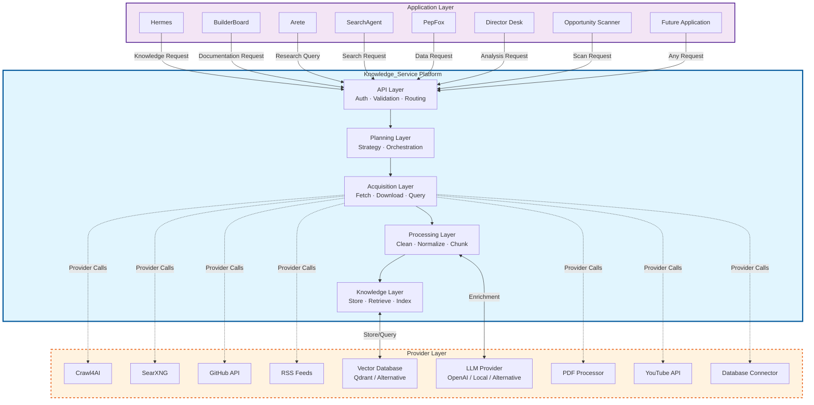
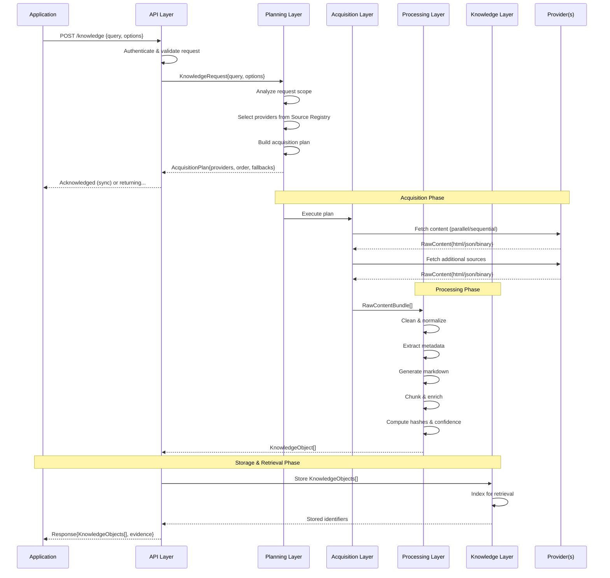
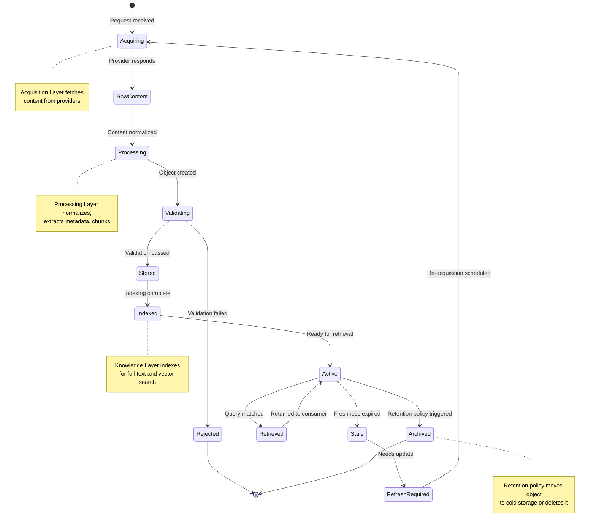
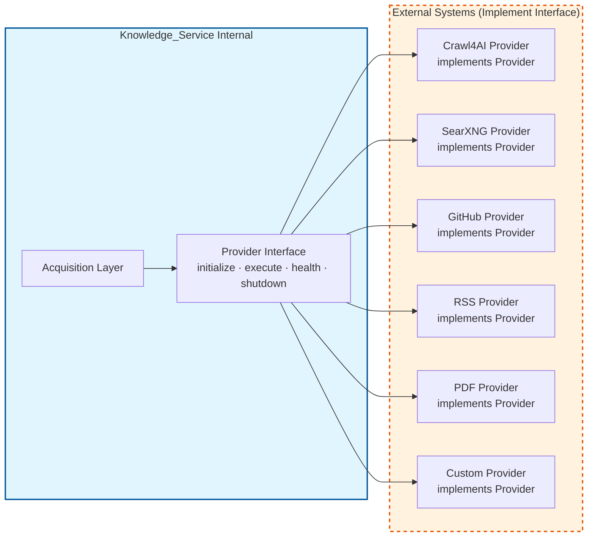
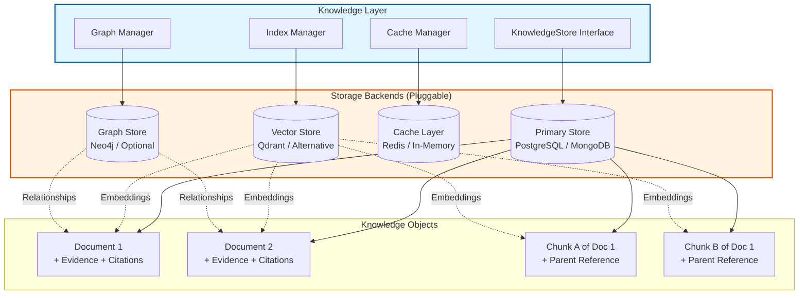
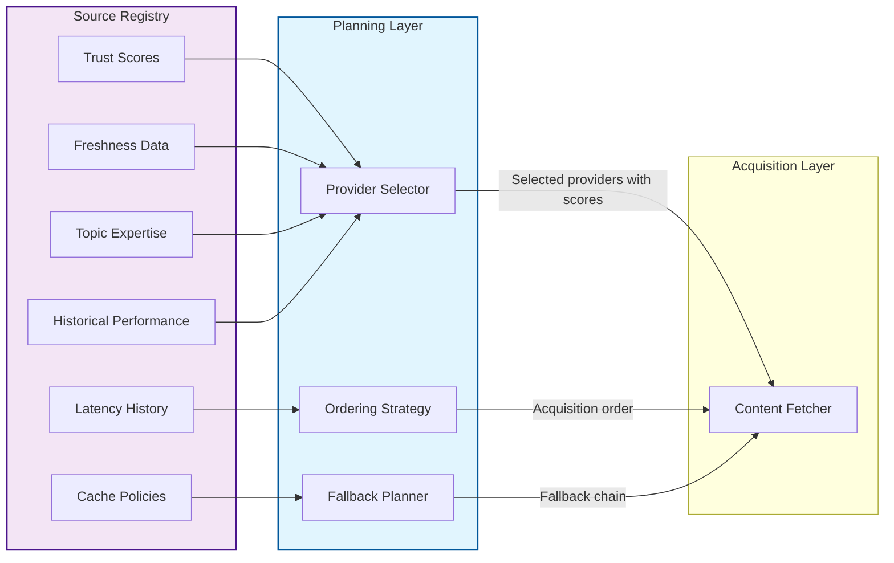

# System Diagram — Architecture Visualizations

## Purpose

This document provides visual representations of the Knowledge_Service architecture through Mermaid diagrams. These diagrams illustrate system components, data flow, knowledge lifecycle, and layer interactions. They serve as a quick-reference complement to the detailed specifications in other documents.

## Scope

This document contains:
- High-level system context diagram
- Layer interaction diagram
- Knowledge acquisition flow diagram
- Knowledge object lifecycle diagram
- Provider abstraction diagram
- Data storage architecture diagram
- Error handling and fallback flow diagram

All diagrams use Mermaid syntax for rendering in Markdown-compatible viewers.

## Diagram 1: System Context

Shows the relationship between applications, Knowledge_Service, and external providers.



**Legend:**
- Solid arrows: Direct data flow through defined interfaces
- Dashed arrows: Provider communication (abstracted through Provider Layer)
- Blue box: Knowledge_Service platform (the system being designed)
- Orange box: External providers (swappable, replaceable)
- Purple box: Applications (consumers, never access providers directly)

## Diagram 2: Layer Interaction

Shows how data flows through each layer during a knowledge request.



**Key observations:**
1. The Application interacts only with the API Layer
2. Provider communication is entirely internal to Knowledge_Service
3. Each layer transforms data before passing it upward
4. Raw content enters at Acquisition; canonical objects exit at Processing
5. Evidence and metadata are attached progressively through processing

## Diagram 3: Knowledge Acquisition Flow

Shows the decision flow during knowledge acquisition, including fallback behavior.

```mermaid
flowchart TD
    Start[Knowledge Request Received] --> Validate{Request valid?}
    Validate -->|No| Error400[Return 400 Bad Request]
    Validate -->|Yes| Plan[Build Acquisition Plan]

    Plan --> CheckCache{Cache hit?<br/>fresh enough?}
    CheckCache -->|Yes| ReturnCached[Return cached knowledge]
    CheckCache -->|No| SelectProviders[Select providers<br/>from Source Registry]

    SelectProviders --> ExecutePlan[Execute acquisition plan]
    ExecutePlan --> ParallelFetch[{Parallel or<br/>sequential?}]

    ParallelFetch -->|Parallel| FetchAll[Fetch all providers<br/>concurrently]
    ParallelFetch -->|Sequential| FetchOne[Fetch primary provider]
    FetchOne --> CheckPrimary{Success?}
    CheckPrimary -->|Yes| ProcessContent
    CheckPrimary -->|No| Fallback1[Try fallback provider]
    Fallback1 --> CheckFallback1{Success?}
    CheckFallback1 -->|Yes| ProcessContent
    CheckFallback1 -->|No| TryNext[Try next fallback]

    FetchAll --> CollectResults[Collect all results]
    CollectResults --> HasAny{Any success?}

    TryNext --> CheckFallback2{More fallbacks?<br/>available?}
    CheckFallback2 -->|Yes| Fallback1
    CheckFallback2 -->|No| PartialResult

    HasAny -->|Yes| ProcessContent
    HasAny -->|No| PartialResult[Partial result with<br/>reduced confidence]

    ProcessContent[Process & normalize content] --> CreateObjects[Create Knowledge Objects]
    CreateObjects --> Store[Store in Knowledge Layer]
    Store --> ReturnFinal[Return knowledge + evidence]

    ReturnCached --> End([End])
    ReturnFinal --> End
    PartialResult --> ReturnPartial[Return partial with<br/>confidence warning]
    ReturnPartial --> End
    Error400 --> End([End])
```

## Diagram 4: Knowledge Object Lifecycle

Shows the complete lifecycle of a knowledge object from acquisition to archival.



## Diagram 5: Provider Abstraction

Shows how the Provider Interface abstracts diverse external systems.



**Key insight:** The Acquisition Layer calls only the Provider Interface. It does not know or care which concrete provider implements it. Adding a new provider requires zero changes to the Acquisition Layer.

## Diagram 6: Data Storage Architecture

Shows how knowledge is stored across different storage backends.



**Storage strategy:**
- **Primary Store**: Stores complete Knowledge Objects with full evidence and metadata
- **Vector Store**: Stores embeddings for semantic search (indexed by Knowledge Object ID)
- **Cache Layer**: Caches frequently accessed objects or query results
- **Graph Store**: Optional; stores relationship data between knowledge objects

The KnowledgeStore interface abstracts the primary store, allowing backend replacement without changing higher layers.

## Diagram 7: Error Handling and Fallback Flow

Shows how errors propagate through layers with graceful degradation.

```mermaid
flowchart TD
    subgraph ProviderLayer["Provider Layer"]
        P1[Provider A] -->|Success| OK1[RawContent]
        P1 -->|Error| E1[ProviderError{type}]
        P2[Provider B] -->|Success| OK2[RawContent]
        P2 -->|Error| E2[ProviderError{type}]

        E1 -->|Timeout| T1[Retry with backoff]
        E1 -->|Rate Limit| R1[Queue + wait]
        E1 -->|Auth Fail| A1[Mark provider unhealthy]
        E1 -->|Permanent| F1[Return error to caller]
    end

    subgraph AcquisitionLayer["Acquisition Layer"]
        T1 --> TryAgain{Retry success?}
        R1 --> TryAgain
        A1 --> SkipProvider[Skip this provider<br/>in plan]
        F1 --> CollectResults

        TryAgain -->|Yes| OK3[RawContent]
        TryAgain -->|No| Fail1[Record failure<br/>reduce confidence]

        OK1 --> CollectResults
        OK2 --> CollectResults
        OK3 --> CollectResults
    end

    subgraph ProcessingLayer["Processing Layer"]
        CollectResults{Any content?<br/>from any provider?}
        Fail1 --> CollectResults

        CollectResults -->|Yes| Process[Process available content]
        CollectResults -->|No| NoContent[Return error:<br/>no sources available]

        Process --> Validate{Processing<br/>successful?}
        Validate -->|Yes| Objects[KnowledgeObjects[]<br/>with reduced confidence]
        Validate -->|Partial| PartialObj[Partial KnowledgeObjects[]<br/>with warnings]
        Validate -->|Fail| ProcError[Return error with context]

        Objects --> ReturnResult
        PartialObj --> ReturnResult
    end

    subgraph APIResponse["API Layer Response"]
        ReturnResult{Result quality?}
        NoContent --> Err503[503 Service Unavailable<br/>+ which providers failed]
        ProcError --> Err500[500 Internal Error<br/>+ trace ID]
        ReturnResult -->|Full confidence| OK200[200 OK + full knowledge]
        ReturnResult -->|Reduced confidence| 200Partial[200 OK + partial knowledge<br/>+ confidence warning]

        Err503 --> End([End])
        Err500 --> End
        OK200 --> End
        200Partial --> End
    end

    style ProviderLayer fill:#ffebee,stroke:#c62828,stroke-width:1px
    style AcquisitionLayer fill:#fff3e0,stroke:#ef6c00,stroke-width:1px
    style ProcessingLayer fill:#fffde7,stroke:#f9a825,stroke-width:1px
    style APIResponse fill:#e8f5e9,stroke:#2e7d32,stroke-width:1px
```

**Error handling principles demonstrated:**
1. Provider errors are caught and normalized at the Provider/Acquisition boundary
2. Retries are attempted with configurable backoff policies
3. Failed providers are marked unhealthy to prevent repeated failures
4. Partial results are returned with confidence reduction rather than complete failure
5. Applications always receive structured responses indicating result quality

## Diagram 8: Source Registry Integration

Shows how the Source Registry feeds into planning decisions.



**Key insight:** The Source Registry is consulted by the Planning Layer during plan construction. It provides historical data that informs provider selection, ordering, and fallback decisions. The registry accumulates experience over time (Principle 6: Accumulative Learning).

## Data Flow Summary

The diagrams collectively illustrate four primary data flows:

### Flow A: Knowledge Acquisition (Write Path)
```
Application → API Layer → Planning → Acquisition → Providers
Providers → Acquisition → Processing → Knowledge Objects → Knowledge Layer → Storage
```

### Flow B: Knowledge Retrieval (Read Path)
```
Application → API Layer → Knowledge Layer → Index/Cache/Graph → Knowledge Objects → Application
```

### Flow C: Source Learning (Feedback Loop)
```
Acquisition Results → Source Registry → Planning Decisions → Better Acquisition
```

### Flow D: Observability (Cross-Cutting)
```
Every Layer → Metrics Emitter → Monitoring System → Dashboards/Alerts
```

## Assumptions

- Mermaid is supported by the documentation viewer
- Diagrams are rendered at sufficient resolution to read all labels
- Color coding follows consistent semantics across diagrams (blue = platform, orange = external, purple = applications)

## Future Evolution

Future phases may add:
- Deployment topology diagrams showing container/orchestration structure
- Sequence diagrams for specific API endpoints
- State machine diagrams for knowledge object lifecycle states
- Network security diagrams showing credential isolation boundaries
- Performance architecture diagrams showing scaling considerations

These would extend, not replace, the diagrams in this document.
