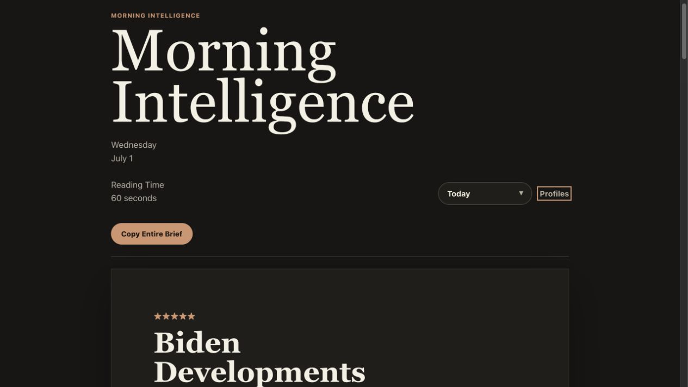
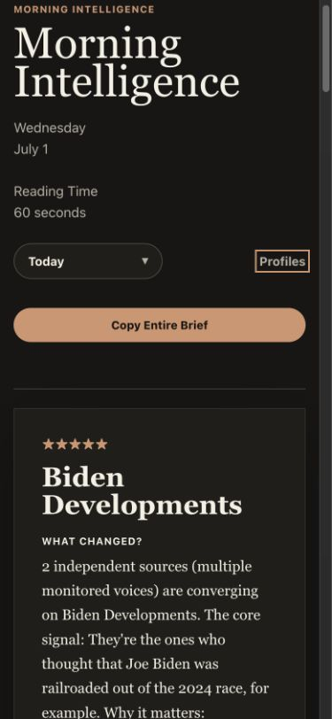
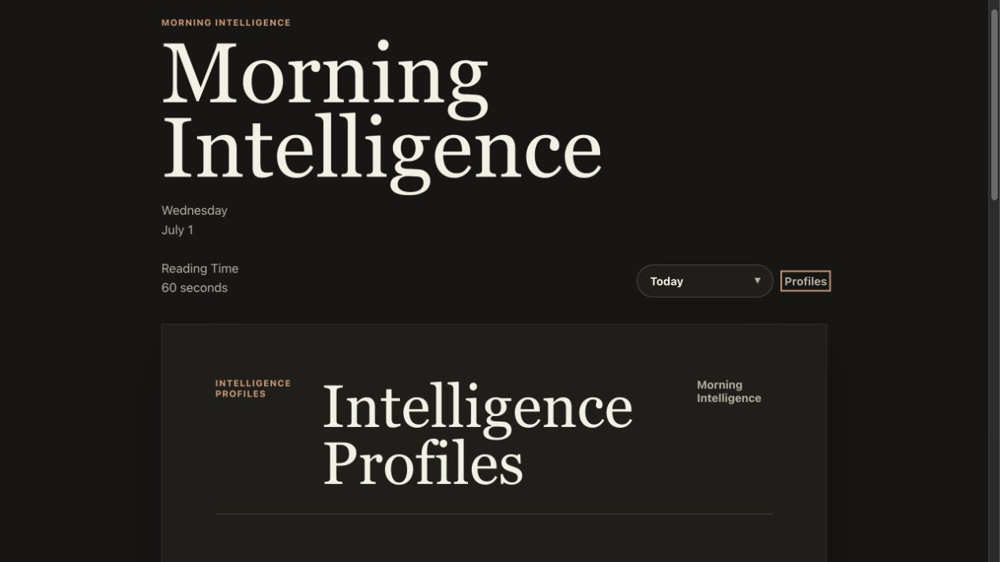
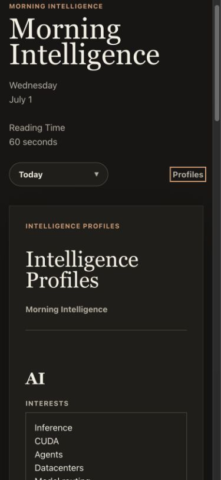
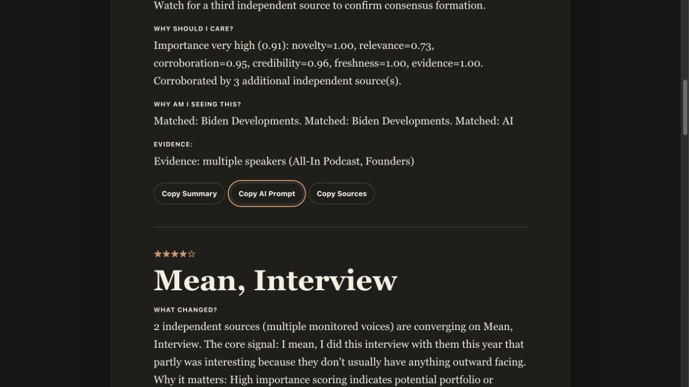

# Morning Intelligence Screenshot Gallery

Permanent home: [latest.html](./latest.html)

## Desktop Report

## Mobile Report

## Desktop Profiles

## Mobile Profiles

## Copy Workflow

## Verification Notes

- Morning Intelligence renders the latest markdown brief as the canonical report.
- The date dropdown loads historical brief documents without an archive screen.
- Intelligence Profiles is the only configuration page.
- Copy AI Prompt includes title, executive summary, why it matters, historical context, evidence, timestamp links, and exploration questions.
- Desktop and mobile layouts were checked for horizontal overflow.
